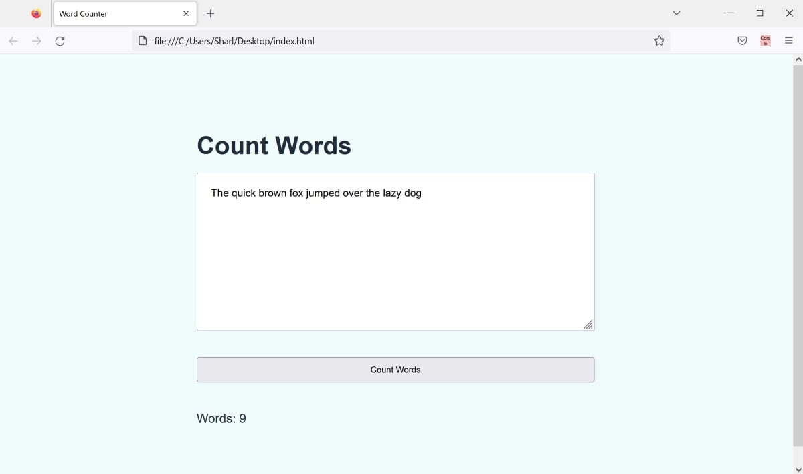

# JS-Word-Counter
This is an example JavaScript word counter. It can count the words in a given sentence or paragraph 

The project consists of:
* index.html - Simple HTML page to open in a browser.
* styles.css - Styling for the HTML page.
* script.js - Functionality for the word counter.

## To Run

* Click on the index.html file to open it in a web browser.

## Example

